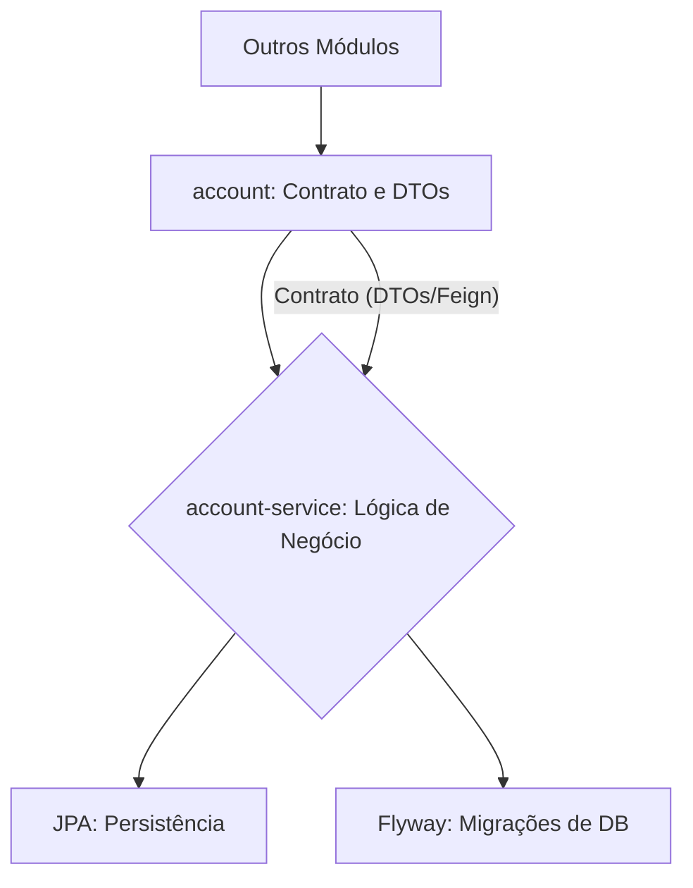

# 🗃️ Módulo de Contas (Account API)

O serviço **Account API** é o pilar para o gerenciamento de contas de usuário dentro do domínio de e-commerce (`store`).

Este microsserviço realiza todas as **operações CRUD** (Criar, Ler, Atualizar, Excluir) essenciais para a **gestão de contas**, estabelecendo a fundação necessária para a **autenticação** e o relacionamento com outros serviços do ecossistema, como `auth`, `order` e `product`.

  * **Criação** (Cadastro)
  * **Busca** (Consulta)
  * **Atualização**
  * **Exclusão**

> 🔒 **Camada de Confiança (*Trusted Layer*) e Roteamento Seguro**
>
> Todas as comunicações externas passam obrigatoriamente pelo **Gateway** da aplicação. As rotas sob `/account/**` são **protegidas por *token***, exigindo o envio do cabeçalho de autenticação: `Authorization: Bearer <jwt>`.

-----

## 🏛️ Componentes e Estrutura

A Account API é dividida em dois submódulos principais, garantindo a separação de responsabilidades:

| Módulo | Responsabilidade | Tecnologias Chave |
| :--- | :--- | :--- |
| **`account`** | **Interface/Contrato** - Define o contrato (DTOs e Interfaces Feign) que será consumido por outros serviços e aplicações *front-end*. | DTOs, Feign |
| **`account-service`** | **Implementação Principal** - Contém a lógica de negócio, a camada REST, persistência de dados e *scripts* de migração de banco de dados. | REST, JPA, Flyway |



-----

## 🌐 Fluxo de Comunicação

A comunicação com a API segue um fluxo de segurança e processamento em camadas:

```mermaid
graph TD
    internet[🌍 Internet] --> gateway{🛡️ Gateway};
    gateway --> accountService[⚙️ account-service];
    accountService --> db[💾 Database (JPA/Flyway)];
```

## 📂 Módulo de Contrato (account)

Este módulo expõe a interface e os Data Transfer Objects (DTOs) para os consumidores externos.

```tree
api/
    account/
        src/
            main/
                java/
                    store/
                        account/
                            AccountController.java
                            AccountIn.java
                            AccountOut.java
        pom.xml
        Jenkinsfile
```

| Arquivo | Descrição | Link |
| :--- | :--- | :--- |
| **pom.xml** | Configuração do Maven para o módulo de contrato | [:octicons-link-external-16:](https://raw.githubusercontent.com/Lagoass/account/refs/heads/main/pom.xml) |
| **Jenkinsfile** | Pipeline de CI/CD do módulo de contrato | [:octicons-link-external-16:](https://raw.githubusercontent.com/Lagoass/account/refs/heads/main/Jenkinsfile) |
| **AccountController.java** | Interface Feign para comunicação entre serviços | [:octicons-link-external-16:](https://raw.githubusercontent.com/Lagoass/account/refs/heads/main/src/main/java/store/account/AccountController.java) |
| **AccountIn.java** | DTO de entrada para operações de conta | [:octicons-link-external-16:](https://raw.githubusercontent.com/Lagoass/account/refs/heads/main/src/main/java/store/account/AccountIn.java) |
| **AccountOut.java** | DTO de saída para operações de conta | [:octicons-link-external-16:](https://raw.githubusercontent.com/Lagoass/account/refs/heads/main/src/main/java/store/account/AccountOut.java) |

```{ bash }
> mvn clean install
```

## ⚙️ Módulo de Serviço (account-service)

Onde a lógica de negócio e a persistência de dados são implementadas.

```tree
api/
    account-service/
        k8s/
            k8s.yaml
        src/
            main/
                java/
                    store/
                        account/
                            Account.java
                            AccountApplication.java
                            AccountModel.java
                            AccountParser.java
                            AccountRepository.java
                            AccountResource.java
                            AccountService.java
                resources/
                    application.yaml
                    db/
                        migration/
                            V2025.08.29.001__create_schema.sql
                            V2025.08.29.002__create_table_account.sql
                            V2025.09.02.001__create_index_email.sql
        pom.xml
        Dockerfile
        Jenkinsfile
```

| Arquivo | Descrição | Link |
| :--- | :--- | :--- |
| **pom.xml** | Configuração do Maven para o serviço principal | [:octicons-link-external-16:](https://raw.githubusercontent.com/Lagoass/account-service/refs/heads/main/pom.xml) |
| **Dockerfile** | Container Docker para deploy | [:octicons-link-external-16:](https://raw.githubusercontent.com/Lagoass/account-service/refs/heads/main/DockerFile) |
| **Jenkinsfile** | Pipeline de CI/CD do serviço | [:octicons-link-external-16:](https://raw.githubusercontent.com/Lagoass/account-service/refs/heads/main/Jenkinsfile) |
| **k8s.yaml** | Manifesto Kubernetes para deploy | [:octicons-link-external-16:](https://raw.githubusercontent.com/Lagoass/account-service/refs/heads/main/k8s/k8s.yaml) |
| **application.yaml** | Configurações da aplicação Spring Boot | [:octicons-link-external-16:](https://raw.githubusercontent.com/Lagoass/account-service/refs/heads/main/src/main/resources/application.yaml) |
| **Account.java** | Entidade de domínio Account | [:octicons-link-external-16:](https://raw.githubusercontent.com/Lagoass/account-service/refs/heads/main/src/main/java/store/account/Account.java) |
| **AccountApplication.java** | Classe principal da aplicação Spring Boot | [:octicons-link-external-16:](https://raw.githubusercontent.com/Lagoass/account-service/refs/heads/main/src/main/java/store/account/AccountApplication.java) |
| **AccountModel.java** | Modelo de dados JPA | [:octicons-link-external-16:](https://raw.githubusercontent.com/Lagoass/account-service/refs/heads/main/src/main/java/store/account/AccountModel.java) |
| **AccountParser.java** | Conversor entre entidade e DTO | [:octicons-link-external-16:](https://raw.githubusercontent.com/Lagoass/account-service/refs/heads/main/src/main/java/store/account/AccountParser.java) |
| **AccountRepository.java** | Repositório JPA para persistência | [:octicons-link-external-16:](https://raw.githubusercontent.com/Lagoass/account-service/refs/heads/main/src/main/java/store/account/AccountRepository.java) |
| **AccountResource.java** | Controller REST | [:octicons-link-external-16:](https://raw.githubusercontent.com/Lagoass/account-service/refs/heads/main/src/main/java/store/account/AccountResource.java) |
| **AccountService.java** | Lógica de negócio do serviço | [:octicons-link-external-16:](https://raw.githubusercontent.com/Lagoass/account-service/refs/heads/main/src/main/java/store/account/AccountService.java) |
| **V2025.08.29.001__create_schema.sql** | Migração Flyway - Criação do schema | [:octicons-link-external-16:](https://raw.githubusercontent.com/Lagoass/account-service/refs/heads/main/src/main/resources/db/migration/V2025.08.29.001__create_schema.sql) |
| **V2025.08.29.002__create_table_account.sql** | Migração Flyway - Criação da tabela account | [:octicons-link-external-16:](https://raw.githubusercontent.com/Lagoass/account-service/refs/heads/main/src/main/resources/db/migration/V2025.08.29.002__create_table_account.sql) |
| **V2025.09.02.001__create_index_email.sql** | Migração Flyway - Índice para email | [:octicons-link-external-16:](https://raw.githubusercontent.com/Lagoass/account-service/refs/heads/main/src/main/resources/db/migration/V2025.09.02.001__create_index_email.sql) |

```{ bash }
> mvn clean package spring-boot:run
```