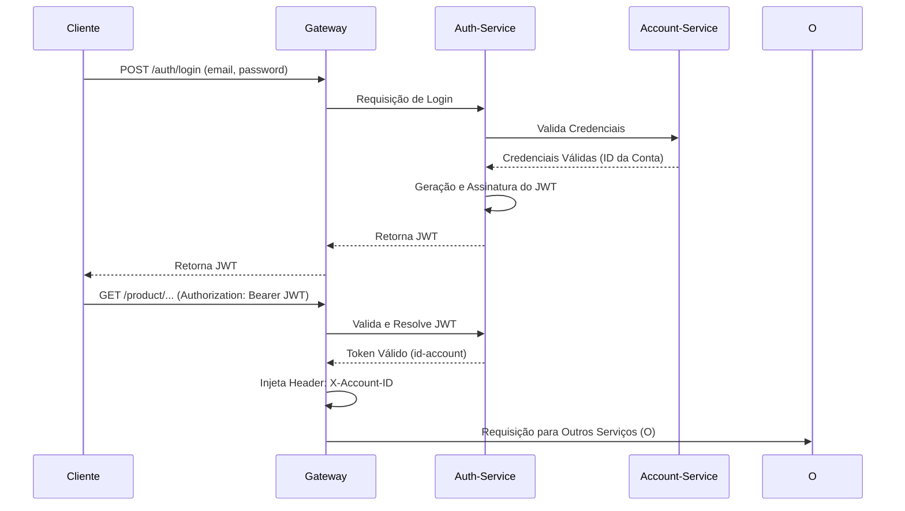
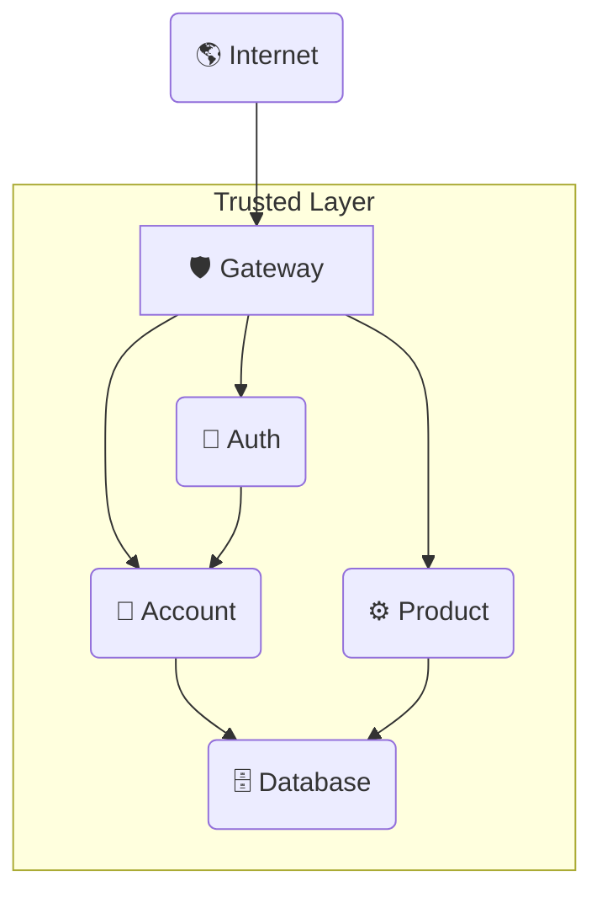

# Serviço de Autenticação (Auth API) 🔐

A **Auth API** é um componente de segurança crucial. Sua responsabilidade primária é a **autenticação de usuários** e a **emissão de tokens JWT** que são essenciais para proteger e autorizar as comunicações em todos os microsserviços do domínio `store`. Este serviço garante a **integridade** e a **segurança** de todas as requisições subsequentes.

-----

## 💡 Componentes Chave

### O Serviço Principal (`auth-service`)

O serviço de autenticação é construído em **Spring Boot (Java)** e atua como a autoridade central para emissão de tokens.

  * **Exposição:** Expõe *endpoints* públicos (`/login`, `/register`).
  * **Dependência:** Se comunica com o `account-service` para **validar as credenciais** do usuário.
  * **Geração de Token:** Emite tokens **JWT** (JSON Web Token) que são assinados usando a chave secreta definida em `JWT_SECRET_KEY`.

### ➡️ Fluxo de Autenticação (Login)

1.  O **Cliente** envia as credenciais (`email` e `password`) para o *endpoint* de login: `/auth/login`.
2.  A **Auth API** realiza a validação dessas credenciais junto ao `account-service`.
3.  Em caso de sucesso na validação, um **Token JWT** é criado, assinado e retornado ao cliente.
4.  O **Gateway** passa a usar este JWT para validar as requisições subsequentes, extraindo e injetando o **ID do usuário** (`id-account`) nos *headers* para os outros microsserviços.

> **Importante:** Após o login bem-sucedido, o **JWT** deve ser incluído no *header* `Authorization: Bearer <token>` em todas as requisições futuras para serviços protegidos (como `account`, `order`, `product`, etc.).



## 🗺️ Visão do Ecossistema (Fluxo de Dados)

O diagrama a seguir destaca a posição central da Auth API dentro do ecossistema de segurança:



## 🏗️ Módulo de Contrato (auth)

Contém as interfaces públicas e os DTOs utilizados para a autenticação e registro.

```tree
api/
    auth/
        src/
            main/
                java/
                    store/
                        auth/
                            AuthController.java
                            LoginIn.java
                            RegisterIn.java
                            TokenOut.java
        pom.xml
        Jenkinsfile
```

??? info "Source"

````
=== "pom.xml"

    ``` { .yaml .copy .select linenums="1" }
    --8<-- "https://raw.githubusercontent.com/Lagoass/auth/refs/heads/main/pom.xml"
    ```

=== "Jenkinsfile"

    ``` { .jenkinsfile .copy .select linenums="1" }
    --8<-- "https://raw.githubusercontent.com/Lagoass/auth/refs/heads/main/Jenkinsfile"
    ```

=== "AuthController.java"

    ``` { .java title='AuthController.java' .copy .select linenums='1' }
    --8<-- "https://raw.githubusercontent.com/Lagoass/auth/refs/heads/main/src/main/java/store/auth/AuthController.java"
    ```

=== "LoginIn.java"

    ``` { .java title='LoginIn.java' .copy .select linenums='1' }
    --8<-- "https://raw.githubusercontent.com/Lagoass/auth/refs/heads/main/src/main/java/store/auth/LoginIn.java"
    ```

=== "RegisterIn.java"

    ``` { .java title='RegisterIn.java' .copy .select linenums='1' }
    --8<-- "https://raw.githubusercontent.com/Lagoass/auth/refs/heads/main/src/main/java/store/auth/RegisterIn.java"
    ```

=== "TokenOut.java"

    ``` { .java title='TokenOut.java' .copy .select linenums='1' }
    --8<-- "https://raw.githubusercontent.com/Lagoass/auth/refs/heads/main/src/main/java/store/auth/TokenOut.java"
    ```
````

```{ bash }
> mvn clean install
```

## ⚙️ Módulo de Implementação (auth-service)

Onde a lógica de autenticação e a emissão do JWT são implementadas.

```tree
api/
    auth-service/
        k8s/
            k8s.yaml
        src/
            main/
                java/
                    store/
                        auth/
                            AuthApplication.java
                            AuthResource.java
                            AuthService.java
                            JwtService.java
            resources/
                application.yaml
        pom.xml
        Dockerfile
        Jenkinsfile
```

??? info "Source"

````
=== "pom.xml"

    ``` { .yaml .copy .select linenums="1" }
    --8<-- "https://raw.githubusercontent.com/Lagoass/auth-service/refs/heads/main/pom.xml"
    ```

=== "Dockerfile"

    ``` { .java .copy .select linenums='1' }
    --8<-- "https://raw.githubusercontent.com/Lagoass/auth-service/refs/heads/main/DockerFile"
    ```

=== "Jenkinsfile"

    ``` { .jenkinsfile .copy .select linenums="1" }
    --8<-- "https://raw.githubusercontent.com/Lagoass/auth-service/refs/heads/main/Jenkinsfile"
    ```

=== "k8s.yaml"

    ``` { .yaml .copy .select linenums="1" }
    --8<-- "https://raw.githubusercontent.com/Lagoass/auth-service/refs/heads/main/k8s/k8s.yaml"
    ```

=== "application.yaml"

    ``` { .yaml .copy .select linenums="1" }
    --8<-- "https://raw.githubusercontent.com/Lagoass/auth-service/refs/heads/main/src/main/resources/application.yaml"
    ```

=== "AuthApplication.java"

    ``` { .java .copy .select linenums='1' }
    --8<-- "https://raw.githubusercontent.com/Lagoass/auth-service/refs/heads/main/src/main/java/store/auth/AuthApplication.java"
    ```

=== "AuthResource.java"

    ``` { .java .copy .select linenums='1' }
    --8<-- "https://raw.githubusercontent.com/Lagoass/auth-service/refs/heads/main/src/main/java/store/auth/AuthResource.java"
    ```

=== "AuthService.java"

    ``` { .java .copy .select linenums='1' }
    --8<-- "https://raw.githubusercontent.com/Lagoass/auth-service/refs/heads/main/src/main/java/store/auth/AuthService.java"
    ```

=== "JwtService.java"

    ``` { .java .copy .select linenums='1' }
    --8<-- "https://raw.githubusercontent.com/Lagoass/auth-service/refs/heads/main/src/main/java/store/auth/JwtService.java"
    ```
````

```{ bash }
> mvn clean package spring-boot:run
```