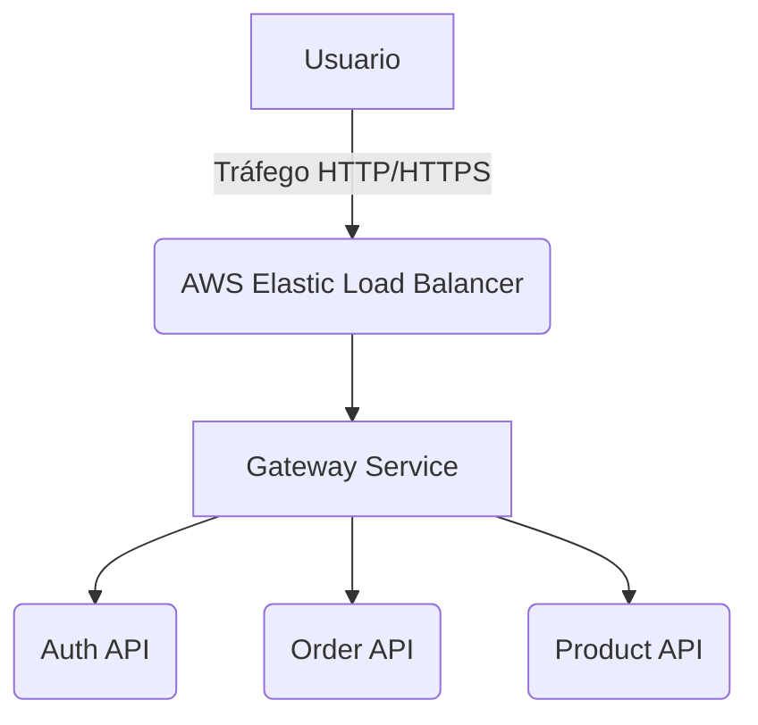

# Estratégias de Resiliência e Escalabilidade (EKS/Redis) 🚀

Este documento detalha as medidas de engenharia adotadas no `store-api` para garantir a **alta disponibilidade** e mitigar **gargalos de desempenho**. As estratégias se concentram em dois pilares principais:

1.  **Balanceamento de Carga** e Ponto de Entrada Único (AWS ELB).
2.  **Cache Distribuído** para otimização de leitura (Redis).

-----

## 1\. Entrada e Balanceamento de Carga (AWS ELB)

O **[Gateway Service](../gatewayapi/main.md)** é o ponto de entrada primário e a primeira camada de resiliência. Todas as requisições externas são distribuídas por um Load Balancer nativo da AWS.

> 📢 **Service Type LoadBalancer:**
>
> O *Service* Kubernetes do Gateway é do tipo `LoadBalancer`. Essa configuração instrui o **AWS EKS** (Elastic Kubernetes Service) a provisionar automaticamente um **Elastic Load Balancer (ELB)** dedicado para o tráfego do domínio.

### 🔹 Topologia de Roteamento



-----

## 2\. Cache Distribuído de Produtos (Redis)

O **[Product Service](../productapi/main.md)** utiliza uma instância do **Redis** como camada de *cache* primária. O objetivo é reduzir a latência de leituras frequentes e diminuir a carga sobre o banco de dados principal (PostgreSQL). A implementação é realizada através da abstração de *cache* do Spring Boot.

### 🔹 Fluxo de Decisão do Cache-Aside

```mermaid
flowchart TD
    A[Requisição GET /product] --> B{Produto está no Redis?};
    B -- Sim (HIT) --> C[Retorna do Cache (Baixa Latência)];
    B -- Não (MISS) --> D[Busca no PostgreSQL];
    D --> E[Grava Resultado no Redis];
    E --> C;
```

### 🔹 Política de Cache do Product Service

| Estratégia de Cache | Anotação / Chave | Tempo de Vida (TTL) |
| :--- | :--- | :--- |
| **Lista Completa** | `@Cacheable("products-list")` | 2 minutos |
| **Item Individual** | `@Cacheable("product-by-id")` | 10 minutos |
| **Modificação (CRUD)** | `@CacheEvict` nas chaves afetadas | (Ilimitado) |

-----

## 3\. Implementação do Redis (Kubernetes ClusterIP)

O Redis é implantado em um *Deployment* dedicado no cluster e exposto internamente via *Service* do tipo **ClusterIP** para garantir que apenas microsserviços internos possam acessá-lo.

```yaml
kind: Deployment
# ...
spec:
  replicas: 1
  template:
    # ...
    spec:
      containers:
        - name: redis
          image: redis:latest
          ports:
            - containerPort: 6379
---
kind: Service
spec:
  type: ClusterIP
  ports:
    - port: 6379
      targetPort: 6379
  selector:
    app: redis
```

### 🔹 Configuração de Conexão (Product Service)

O *Product Service* utiliza as seguintes variáveis de ambiente para a conexão segura interna:

| Variável | Valor | Finalidade |
| :--- | :--- | :--- |
| **`SPRING_CACHE_TYPE`** | `redis` | Ativa o cache Redis no Spring Boot. |
| **`SPRING_DATA_REDIS_HOST`** | `redis` | Resolve o DNS interno do Service ClusterIP. |
| **`SPRING_DATA_REDIS_PORT`** | `6379` | Porta padrão do Redis. |

-----

## 💡 Benefícios Consolidados

  * **Distribuição Automática:** O ELB distribui o tráfego uniformemente para as instâncias do *Gateway Service*.
  * **Leituras Rápidas:** O Redis elimina a necessidade de acessar o PostgreSQL para dados frequentes, reduzindo o tempo de resposta em até **90%**.
  * **Proteção de Banco de Dados:** A estratégia de *cache* reduz significativamente a pressão de E/S (*I/O*) no PostgreSQL.
  * **Escalabilidade Horizontal:** Todos os serviços são *stateless* (com exceção da persistência no DB/Redis), permitindo escalabilidade horizontal elástica via *Horizontal Pod Autoscaler* (HPA) do Kubernetes.

-----

\!\!\! success "Conclusão da Arquitetura de Bottlenecks"

```
A combinação do **AWS ELB** (resiliência e entrada única) e do **Redis Cache** (desempenho e otimização de dados) estabelece uma arquitetura robusta e escalável, pronta para gerenciar picos de demanda no ecossistema `store-api`.
```