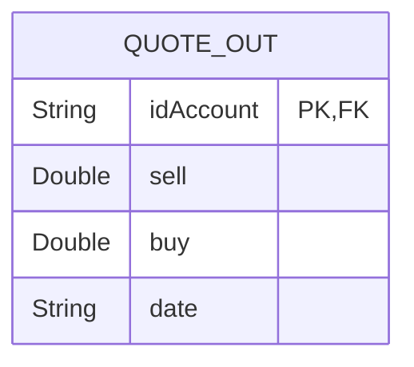
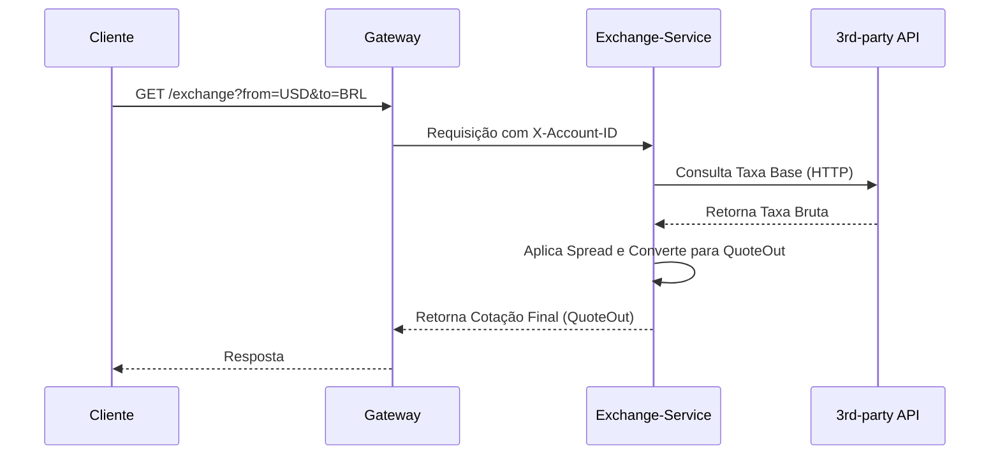

# Serviço de Câmbio (Exchange API) 💱

A **Exchange API** é responsável por fornecer cotações de câmbio precisas para o domínio `store`. Ele permite a conversão entre moedas (`from_curr` para `to_curr`), aplicando automaticamente o **spread** configurado. Todas as operações são **rastreadas** e vinculadas ao usuário autenticado.

-----

## 🔒 Regras de Acesso e Segurança

O Exchange API está situado dentro da *Trusted Layer* (Camada de Confiança) e, portanto, exige autenticação completa:

> 🚪 **Ponto de Acesso:** Exclusivamente via **Gateway**.
>
> 🔑 **Autorização:** A rota `/exchange/**` é protegida. O cliente deve enviar o cabeçalho: `Authorization: Bearer <jwt>`.

-----

## 🐍 Implementação e Dependências

O serviço de câmbio tem uma implementação distinta dos demais:

  * **Tecnologia:** É um microsserviço desenvolvido em **FastAPI** (framework Python de alta performance).
  * **Função Central:** Busca a taxa base de um **provedor externo** (via HTTP) e aplica uma margem (`spread`) para determinar os valores finais de compra e venda.
  * **Saída:** Retorna a cotação processada (`QuoteOut`), incluindo os preços de compra (*buy*) e venda (*sell*).

<!-- end list -->



## 🔁 Fluxo Operacional (Gateway e Terceiros)

A consulta de câmbio é o único fluxo que interage com uma API externa (Terceiros):



## 📁 Estrutura do Exchange-Service (Python)

A estrutura do projeto em Python (`app/`) é organizada em módulos para configuração, autenticação e clientes de API.

```tree
api/
    exchange-service/
        app/
            __init__.py
            main.py
            auth.py
            config.py
            models.py
            clients/
                __init__.py
                rates.py
        requirements.txt
        Dockerfile
```

??? info "Source"

    === "requirements.txt"

        `{ .txt .copy .select linenums="1" }         --8<-- "https://raw.githubusercontent.com/Lagoass/exchange-service/refs/heads/main/requirements.txt"        `

    === "Dockerfile"

        `{ .dockerfile .copy .select linenums="1" }         --8<-- "https://raw.githubusercontent.com/Lagoass/exchange-service/refs/heads/main/DockerFile"        `

    === "main.py"

        `{ .python .copy .select linenums="1" }         --8<-- "https://raw.githubusercontent.com/Lagoass/exchange-service/refs/heads/main/app/main.py"        `

    === "auth.py"

        `{ .python .copy .select linenums="1" }         --8<-- "https://raw.githubusercontent.com/Lagoass/exchange-service/refs/heads/main/app/auth.py"        `

    === "config.py"

        `{ .python .copy .select linenums="1" }         --8<-- "https://raw.githubusercontent.com/Lagoass/exchange-service/refs/heads/main/app/config.py"        `

    === "models.py"

        `{ .python .copy .select linenums="1" }         --8<-- "https://raw.githubusercontent.com/Lagoass/exchange-service/refs/heads/main/app/models.py"        `

    === "clients/rates.py"

        `{ .python .copy .select linenums="1" }         --8<-- "https://raw.githubusercontent.com/Lagoass/exchange-service/refs/heads/main/app/clients/rates.py"        `