# Serviço de Câmbio (Exchange API) 💱

A **Exchange API** é responsável por fornecer cotações de câmbio precisas para o domínio `store`. Ele permite a conversão entre moedas (`from_curr` para `to_curr`), aplicando automaticamente o **spread** configurado. Todas as operações são **rastreadas** e vinculadas ao usuário autenticado.

-----

## 🔒 Regras de Acesso e Segurança

O Exchange API está situado dentro da *Trusted Layer* (Camada de Confiança) e, portanto, exige autenticação completa:

> 🚪 **Ponto de Acesso:** Exclusivamente via **Gateway**.
>
> 🔑 **Autorização:** A rota `/exchange/**` é protegida. O cliente deve enviar o cabeçalho: `Authorization: Bearer <jwt>`.

-----

## 🐍 Implementação e Dependências

O serviço de câmbio tem uma implementação distinta dos demais:

  * **Tecnologia:** É um microsserviço desenvolvido em **FastAPI** (framework Python de alta performance).
  * **Função Central:** Busca a taxa base de um **provedor externo** (via HTTP) e aplica uma margem (`spread`) para determinar os valores finais de compra e venda.
  * **Saída:** Retorna a cotação processada (`QuoteOut`), incluindo os preços de compra (*buy*) e venda (*sell*).

<!-- end list -->


## 🔁 Fluxo Operacional (Gateway e Terceiros)

A consulta de câmbio é o único fluxo que interage com uma API externa (Terceiros):

```mermaid
sequenceDiagram
    participant C as Cliente
    participant G as Gateway
    participant ES as Exchange-Service
    participant TP as 3rd-party API

    C->>G: GET /exchange?from=USD&to=BRL
    G->>ES: Requisição com X-Account-ID
    ES->>TP: Consulta Taxa Base (HTTP)
    TP-->>ES: Retorna Taxa Bruta
    ES->>ES: Aplica Spread e Converte para QuoteOut
    ES-->>G: Retorna Cotação Final (QuoteOut)
    G-->>C: Resposta
```



## 📁 Estrutura do Exchange-Service (Python)

A estrutura do projeto em Python (`app/`) é organizada em módulos para configuração, autenticação e clientes de API.

```tree
api/
    exchange-service/
        app/
            __init__.py
            main.py
            auth.py
            config.py
            models.py
            clients/
                __init__.py
                rates.py
        requirements.txt
        Dockerfile
```

| Arquivo | Descrição | Link |
| :--- | :--- | :--- |
| **requirements.txt** | Dependências Python do projeto FastAPI | [:octicons-link-external-16:](https://raw.githubusercontent.com/Lagoass/exchange-service/refs/heads/main/requirements.txt) |
| **Dockerfile** | Container Docker para deploy | [:octicons-link-external-16:](https://raw.githubusercontent.com/Lagoass/exchange-service/refs/heads/main/DockerFile) |
| **main.py** | Aplicação principal FastAPI | [:octicons-link-external-16:](https://raw.githubusercontent.com/Lagoass/exchange-service/refs/heads/main/app/main.py) |
| **auth.py** | Módulo de autenticação JWT | [:octicons-link-external-16:](https://raw.githubusercontent.com/Lagoass/exchange-service/refs/heads/main/app/auth.py) |
| **config.py** | Configurações da aplicação | [:octicons-link-external-16:](https://raw.githubusercontent.com/Lagoass/exchange-service/refs/heads/main/app/config.py) |
| **models.py** | Modelos Pydantic (DTOs) | [:octicons-link-external-16:](https://raw.githubusercontent.com/Lagoass/exchange-service/refs/heads/main/app/models.py) |
| **clients/rates.py** | Cliente HTTP para API de cotações externas | [:octicons-link-external-16:](https://raw.githubusercontent.com/Lagoass/exchange-service/refs/heads/main/app/clients/rates.py) |