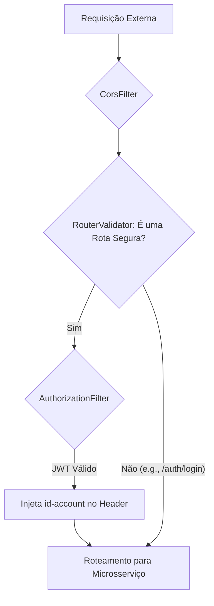
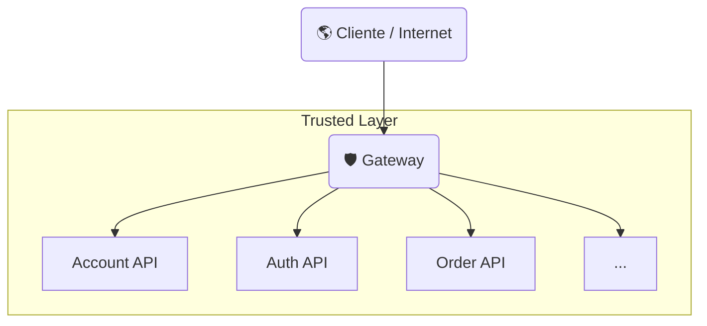

# API Gateway (Proxy Reverso e Segurança) 🛡️

O **Gateway API** é o *proxy* reverso e o **ponto único de entrada (Single Entry Point)** da arquitetura de microsserviços `store`. Sua função é crítica: **rotear** o tráfego externo para o serviço correto, aplicar **autenticação e autorização** centralizadas e garantir a segurança e a resiliência da plataforma.

-----

## 🎯 Funções Essenciais (Trusted Layer)

Toda comunicação externa com os microsserviços do projeto deve seguir este fluxo obrigatório:

  * **Entrada Exclusiva:** ⬅️ Todas as requisições chegam primeiro ao Gateway.
  * **Validação de Segurança:** O Gateway verifica a presença e a validade do **JWT**.
  * **Injeção de Contexto:** Após a validação, injeta o **ID da conta** (`id-account`) nos *headers* HTTP.
  * **Roteamento:** ➡️ Redireciona a requisição para o microsserviço de destino (`account`, `order`, `product`, etc.).

-----

## 🚦 Arquitetura e Fluxo de Filtros

O `gateway-service` é construído com **Spring Cloud Gateway (Java)**. O roteamento e as políticas de segurança são aplicadas por meio de filtros customizados na cadeia de requisições.

| Componente | Responsabilidade | Lógica Chave |
| :--- | :--- | :--- |
| **`AuthorizationFilter`** | Segurança e Autenticação | Filtro principal que valida o JWT e enriquece a requisição com o `id-account`. |
| **`RouterValidator`** | Definição de Rotas | Determina quais *endpoints* (rotas) são públicos e quais exigem um JWT (rotas seguras). |
| **`CorsFilter`** | Gerenciamento CORS | Configurações para permitir requisições seguras de *front-ends* hospedados em domínios diferentes. |

### Ciclo de Vida da Requisição



## 🗺️ Topologia de Rede e Roteamento

O Gateway é a camada desprotegida (pública) que serve como *frontend* da arquitetura de serviços protegidos:



## 🛠️ Implementação do Gateway Service

O projeto contém o código do serviço de Gateway, incluindo a lógica de segurança no subpacote `security`.

```tree
api
    gateway-service/
        k8s/
            k8s.yaml
        src/
            main/
                java/
                    store/
                        gateway/
                            GatewayApplication.java
                            GatewayResource.java
                            security
                                CorsFilter.java
                                AuthorizationFilter.java
                                RouterValidator.java
                resources/
                    application.yaml
        pom.xml
        Dockerfile
        Jenkinsfile
```

| Arquivo (Título do Tab) | Linguagem | URL do Arquivo Remoto (`--8<--`) |
| :--- | :--- | :--- |
| **pom.xml** | `.xml` | `https://raw.githubusercontent.com/Lagoass/gateway-service/refs/heads/main/pom.xml` |
| **Dockerfile** | `.dockerfile` | `https://raw.githubusercontent.com/Lagoass/gateway-service/refs/heads/main/DockerFile` |
| **Jenkinsfile** | `.jenkinsfile` | `https://raw.githubusercontent.com/Lagoass/gateway-service/refs/heads/main/Jenkinsfile` |
| **k8s.yaml** | `.yaml` | `https://raw.githubusercontent.com/Lagoass/gateway-service/refs/heads/main/k8s/k8s.yaml` |
| **application.yaml** | `.yaml` | `https://raw.githubusercontent.com/Lagoass/gateway-service/refs/heads/main/src/main/resources/application.yaml` |
| **GatewayApplication.java** | `.java` | `https://raw.githubusercontent.com/Lagoass/gateway-service/refs/heads/main/src/main/java/store/gateway/GatewayApplication.java` |
| **GatewayResource.java** | `.java` | `https://raw.githubusercontent.com/Lagoass/gateway-service/refs/heads/main/src/main/java/store/gateway/GatewayResource.java` |
| **CorsFilter.java** | `.java` | `https://raw.githubusercontent.com/Lagoass/gateway-service/refs/heads/main/src/main/java/store/gateway/security/CorsFilter.java` |
| **AuthorizationFilter.java** | `.java` | `https://raw.githubusercontent.com/Lagoass/gateway-service/refs/heads/main/src/main/java/store/gateway/security/AuthorizationFilter.java` |
| **RouterValidator.java** | `.java` | `https://raw.githubusercontent.com/Lagoass/gateway-service/refs/heads/main/src/main/java/store/gateway/security/RouterValidator.java` |

```{ bash }
> mvn clean package spring-boot:run
```