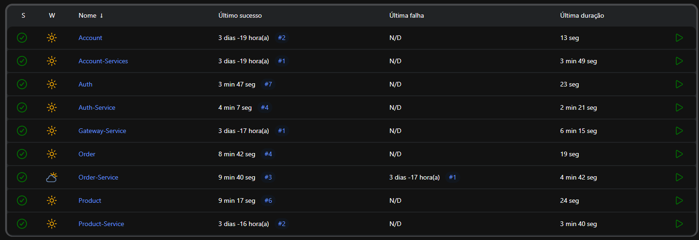
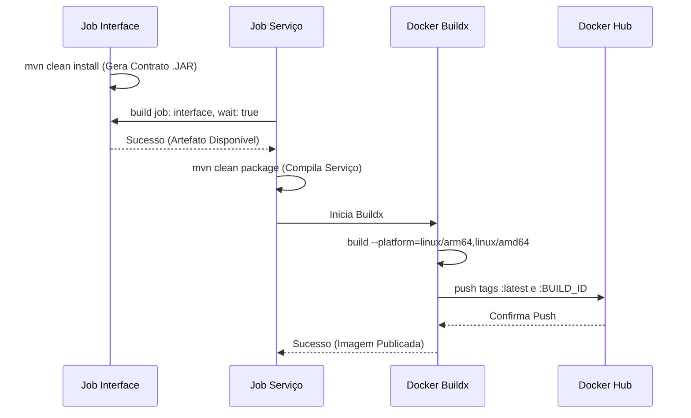

# Visão Geral da Automação CI/CD (Jenkins) ⚙️

O **Jenkins** é o orquestrador da **Esteira de CI/CD** para todos os componentes do domínio `store`. O projeto adota uma arquitetura de *pipeline* dual, garantindo a separação de responsabilidades entre contratos e implementações:

  * **Padrão 1:** *Pipelines* de **Interfaces** (Compilação de Contratos).
  * **Padrão 2:** *Pipelines* de **Serviços** (Build Docker e Publicação).

-----

## 🔬 Comparativo de Padrões de Pipeline

| Característica | Padrão 1: Interfaces (`account`, `order`, ...) | Padrão 2: Serviços (`account-service`, `gateway`, ...) |
| :--- | :--- | :--- |
| **Tecnologias** | Maven (Java/Groovy) | Maven/Python + Docker Buildx |
| **Foco** | Gerar e publicar artefatos/contratos (`.jar`) | Gerar e publicar Imagens **Docker** |
| **Dependências** | Nenhuma | Aciona o job da **Interface** correspondente |
| **Artefato Final** | `.jar` no repositório Maven | Imagem **Docker Multi-arch** no Docker Hub |

## 📊 Status Operacional

O painel de controle do Jenkins provê visibilidade imediata sobre o estado e os *runs* recentes das esteiras ativas:



-----

## 🧩 Padrões de Pipeline (Groovy)

### 1\. Interfaces: Geração de Contratos (.JAR)

> **Objetivo:** Este *pipeline* é rápido e serve apenas para compilar e instalar o artefato de contrato (DTOs, Feign) no repositório Maven do Jenkins, disponibilizando-o para os serviços que dependem dele.

```groovy
pipeline {
    agent any

    stages {
        stage('Compilar Contrato') {
            steps {
                // Gera o artefato JAR e o instala no repositório local/Jenkins
                sh 'mvn -B -DskipTests clean install'
            }
        }
    }
}
```

-----

### 2\. Serviços: Build, Dependência e Docker Multi-arch

> **Objetivo:** Orquestra a construção do binário do serviço, garante que as dependências do contrato estejam atualizadas e, por fim, constrói e publica a imagem Docker no Docker Hub.

```groovy
pipeline {
    agent any
    environment {
        SERVICE = <nome_serviço>                // e.g., account-service, gateway-service
        NAME = "<conta_dockerhub>/${env.SERVICE}"   // Nome final do repositório
    }
    stages {
        stage('Verificar Dependências') {
            steps {
                // Aciona o job da interface correspondente e aguarda o sucesso
                build job: <nome_interface>, wait: true
            }
        }
        stage('Compilar Serviço') { 
            steps {
                // Compila a aplicação (Java: .jar, Python: requerimentos)
                sh 'mvn -B -DskipTests clean package'
            }
        }      
        stage('Build & Push Docker Image') {
            steps {
                withCredentials([usernamePassword(
                    credentialsId: 'dockerhub-credential',
                    usernameVariable: 'USERNAME',
                    passwordVariable: 'TOKEN')]) {
                    sh "docker login -u $USERNAME -p $TOKEN"

                    // Configura o buildx para arquiteturas múltiplas
                    sh "docker buildx create --use --platform=linux/arm64,linux/amd64 --node multi-platform-builder-${env.SERVICE} --name multi-platform-builder-${env.SERVICE}"

                    // Constrói e publica tags :latest e :BUILD_ID para ambas as plataformas
                    sh "docker buildx build --platform=linux/arm64,linux/amd64 --push --tag ${env.NAME}:latest --tag ${env.NAME}:${env.BUILD_ID} -f DockerFile ."

                    // Limpa o builder efêmero
                    sh "docker buildx rm --force multi-platform-builder-${env.SERVICE}"
                }
            }
        }
    }
}
```

-----

## ➡️ Fluxo de Dependência (Interface -\> Serviço)

O diagrama de sequência a seguir ilustra o fluxo de execução das *pipelines* com dependência:



-----

## 📍 Referência: Localização dos Jenkinsfiles

Os *scripts* Groovy de *pipeline* para cada componente podem ser encontrados em suas respectivas documentações:

  * **Interfaces e Serviços Java:**
      * **Account:** [Account API](../accountapi/main.md)
      * **Auth:** [Auth API](../authapi/main.md)
      * **Product:** [Product API](../productapi/main.md)
      * **Order:** [Order API](../orderapi/main.md)
  * **Serviços (incluindo Gateway):**
      * **Gateway-Service:** [Gateway API](../gatewayapi/main.md)

-----

## 📝 Considerações Operacionais e Técnicas

: **Credenciais de Acesso:** O acesso ao Docker Hub para a publicação das imagens é gerenciado pelo secret `dockerhub-credential`.

: **Publicação Multi-Arch:** O uso do `docker buildx` garante que as imagens Docker sejam compatíveis com múltiplas arquiteturas de CPU (`linux/amd64` e `linux/arm64`), crucial para ambientes de *deploy* heterogêneos.

: **Acionamento de Dependência:** A chamada `build job: <interface>` garante que o código do serviço esteja sempre compilando contra a última versão estável do contrato da interface, prevenindo falhas de compilação por dessincronização.

-----