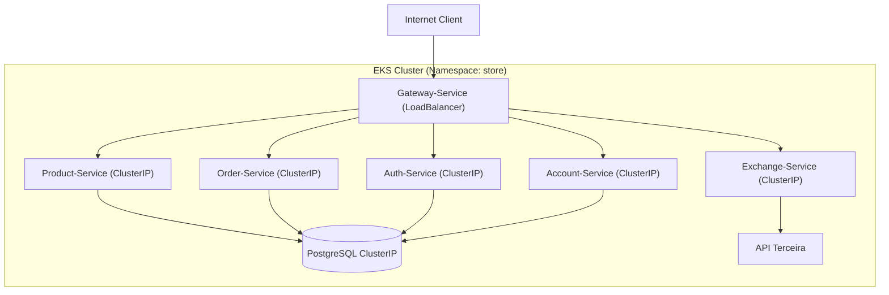

# Orquestração Kubernetes (EKS) – Arquitetura de Deploy ☸️

O ambiente **Kubernetes (K8s)** no **AWS EKS** (Elastic Kubernetes Service) é a fundação que garante a **orquestração, a escalabilidade elástica e a resiliência** contínua dos microsserviços do projeto `store`. Os *manifests* adotam um padrão de **modularização por componente**, facilitando a manutenção e a rastreabilidade do *deploy*.

-----

## 🧩 Padrões de Deploy por Componente

A infraestrutura é segmentada em três categorias principais de *deploy* e *service* para isolamento e controle de acesso:

: **1. Persistência (PostgreSQL, Redis):**
\* Implantado via **Deployment** com Volumes Persistentes (futuro).
\* Exposição estritamente interna via **Service ClusterIP**.
\* Configurações de credenciais via **ConfigMap** e **Secret**.

: **2. Serviços de Domínio (Java/Python):**
\* Microsserviços (`account-service`, `auth-service`, etc.) em **Deployments** independentes.
\* Exposição via **Service ClusterIP**.
\* Comunicação interna exclusiva por **DNS do Cluster** (`<service-name>.<namespace>.svc.cluster.local`).

: **3. Ponto de Entrada (Gateway-Service):**
\* Serviço único exposto via **Service LoadBalancer**.
\* Responsável por criar o **AWS NLB/ALB**, recebendo o tráfego externo e roteando-o para o *Service ClusterIP* interno correspondente.

-----

## ☁️ Estado do Cluster (EKS)

As imagens a seguir confirmam que todos os *Deployments* e *Pods* do projeto estão ativos e em estado `Running` no ambiente EKS:

[EKS Status 1: Pods em execução]
[EKS Status 2: Deployments e réplicas ativas]

-----

## 🗺️ Mapa de Comunicação do Cluster

Este diagrama ilustra a topologia de rede interna e externa, destacando o fluxo de dados através do *Gateway* e as conexões de persistência.

-----

## 📍 Onde Encontrar os Manifests de Deploy

Todos os arquivos de configuração do Kubernetes (`k8s.yaml`) são versionados junto ao código-fonte na subpasta `k8s` de cada módulo:

  * **Account-Service:** [Account API](../accountapi/main.md)
  * **Auth-Service:** [Auth API](../authapi/main.md)
  * **Gateway-Service:** [Gateway API](../gatewayapi/main.md)
  * **Product-Service:** [Product API](../productapi/main.md)
  * **Order-Service:** [Order API](../orderapi/main.md)

-----

## 📝 Notas de Configuração do Ambiente

| Parâmetro | Detalhe | Finalidade |
| :--- | :--- | :--- |
| **Namespace Padrão** | `store` | Garante isolamento lógico e fácil gestão de recursos. |
| **Exposição Externa** | `Service: LoadBalancer` | Provê acesso público e distribuído via **AWS ELB**. |
| **Rede Interna** | `Service: ClusterIP` | Comunicação eficiente e segura baseada em DNS do K8s. |
| **Compatibilidade** | EKS, Minikube, Kind | Permite testes e desenvolvimento em ambientes locais e de produção. |

> **Nota:** A persistência de dados via volume (`PersistentVolume`) para o banco de dados é uma melhoria a ser implementada, garantindo que o ciclo de vida dos dados seja independente do ciclo de vida dos *pods*.

-----

> ✅ **Conclusão:** Todos os *manifests* do Kubernetes seguem um padrão modular e estão prontos para *deploy* no cluster AWS EKS. Esta estrutura garante o isolamento por serviço, a integração completa via *Gateway* e a capacidade de escalar sob demanda.
