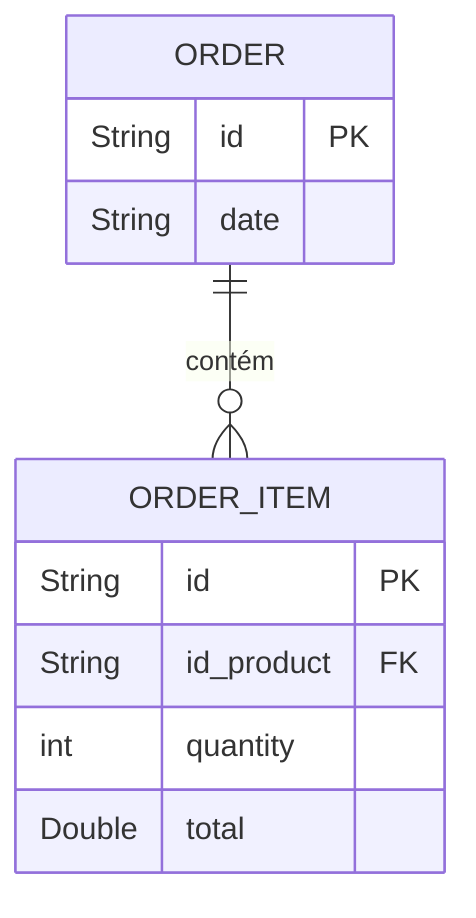
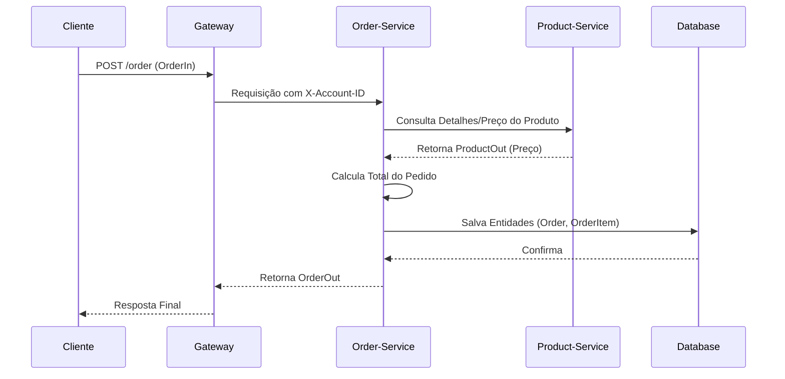

# Microserviço de Pedidos (Order API) 🛒

A **Order API** centraliza a gestão de pedidos (`orders`) no domínio `store`. Sua principal função é permitir que os usuários **autenticados** criem novos pedidos e consultem seu histórico. Este serviço segue o padrão arquitetural do projeto, sendo dividido em **Contrato** (`order`) e **Implementação** (`order-service`).

-----

## 🚨 Segurança e Acesso Restrito

O acesso a este serviço é estritamente controlado para garantir que apenas usuários autenticados possam gerenciar seus pedidos.

  * Todas as requisições devem passar pelo **Gateway**.
  * As rotas sob `/order/**` são **protegidas por JWT**.
  * É obrigatório o envio do cabeçalho: `Authorization: Bearer <jwt>`.

-----

## 🏗️ Estrutura Modular

O microsserviço de pedidos é logicamente dividido para manter a separação de preocupações:

: **Interface (`order`):** Define o **Contrato Público** da API, incluindo **DTOs** (`OrderIn`, `OrderOut`, `OrderItemIn`, `OrderItemOut`) e a interface **Feign** para comunicação entre serviços e *front-ends*.

: **Service (`order-service`):** Contém a **Lógica de Negócio** completa. É responsável pela camada **REST**, regras de validação, persistência via **JPA** e gerenciamento de esquema com **Flyway**.



## 🌐 Fluxo de Criação de Pedidos (Inter-serviços)

O processo de criação de um novo pedido envolve comunicação com outros microsserviços para garantir a integridade dos dados (por exemplo, validando preços de produtos).



## 📘 Módulo de Contrato (order)

Contém a definição dos Data Transfer Objects (DTOs) utilizados em todas as comunicações.

```tree
api/
    order/
        src/
            main/
                java/
                    store/
                        order/
                            OrderController.java
                            OrderIn.java
                            OrderOut.java
                            OrderItemIn.java
                            OrderItemOut.java
        pom.xml
        Jenkinsfile
```

| Arquivo (Título do Tab) | Linguagem | URL do Arquivo Remoto (`--8<--`) |
| :--- | :--- | :--- |
| **pom.xml** | `.xml` | `https://raw.githubusercontent.com/Lagoass/order/refs/heads/main/pom.xml` |
| **Jenkinsfile** | `.jenkinsfile` | `https://raw.githubusercontent.com/Lagoass/order/refs/heads/main/Jenkinsfile` |
| **OrderController.java** | `.java` | `https://raw.githubusercontent.com/Lagoass/order/refs/heads/main/src/main/java/store/order/OrderController.java` |
| **OrderIn.java** | `.java` | `https://raw.githubusercontent.com/Lagoass/order/refs/heads/main/src/main/java/store/order/OrderIn.java` |
| **OrderOut.java** | `.java` | `https://raw.githubusercontent.com/Lagoass/order/refs/heads/main/src/main/java/store/order/OrderOut.java` |
| **OrderItemIn.java** | `.java` | `https://raw.githubusercontent.com/Lagoass/order/refs/heads/main/src/main/java/store/order/OrderItemIn.java` |
| **OrderItemOut.java** | `.java` | `https://raw.githubusercontent.com/Lagoass/order/refs/heads/main/src/main/java/store/order/OrderItemOut.java` |

```{ bash }
> mvn clean install
```

## 🚀 Módulo de Serviço (order-service)

Contém a lógica de negócio, persistência, e o interceptor Feign (`FeignAuthInterceptor.java`) para comunicações seguras com outros microsserviços (como o Product API).

```tree
api/
    order-service/
        k8s/
            k8s.yaml
        src/
            main/
                java/
                    store/
                        order/
                            Order.java
                            OrderItem.java
                            OrderApplication.java
                            OrderModel.java
                            OrderParser.java
                            OrderRepository.java
                            OrderResource.java
                            OrderService.java
                            FeignAuthInterceptor.java
                resources/
                    application.yaml
                    db/
                        migration/
                            V2025.08.29.001__create_schema.sql
                            V2025.08.29.002__create_table_order.sql
                            V2025.08.29.003__create_table_order_item.sql
        pom.xml
        Dockerfile
        Jenkinsfile
```

| Arquivo (Título do Tab) | Linguagem | URL do Arquivo Remoto (`--8<--`) |
| :--- | :--- | :--- |
| **pom.xml** | `.xml` | `https://raw.githubusercontent.com/Lagoass/order-service/refs/heads/main/pom.xml` |
| **Dockerfile** | `.dockerfile` | `https://raw.githubusercontent.com/Lagoass/order-service/refs/heads/main/DockerFile` |
| **Jenkinsfile** | `.jenkinsfile` | `https://raw.githubusercontent.com/Lagoass/order-service/refs/heads/main/Jenkinsfile` |
| **k8s.yaml** | `.yaml` | `https://raw.githubusercontent.com/Lagoass/order-service/refs/heads/main/k8s/k8s.yaml` |
| **application.yaml** | `.yaml` | `https://raw.githubusercontent.com/Lagoass/order-service/refs/heads/main/src/main/resources/application.yaml` |
| **Order.java** | `.java` | `https://raw.githubusercontent.com/Lagoass/order-service/refs/heads/main/src/main/java/store/order/Order.java` |
| **OrderItem.java** | `.java` | `https://raw.githubusercontent.com/Lagoass/order-service/refs/heads/main/src/main/java/store/order/OrderItem.java` |
| **OrderApplication.java** | `.java` | `https://raw.githubusercontent.com/Lagoass/order-service/refs/heads/main/src/main/java/store/order/OrderApplication.java` |
| **OrderService.java** | `.java` | `https://raw.githubusercontent.com/Lagoass/order-service/refs/heads/main/src/main/java/store/order/OrderService.java` |
| **OrderResource.java** | `.java` | `https://raw.githubusercontent.com/Lagoass/order-service/refs/heads/main/src/main/java/store/order/OrderResource.java` |
| **OrderRepository.java** | `.java` | `https://raw.githubusercontent.com/Lagoass/order-service/refs/heads/main/src/main/java/store/order/OrderRepository.java` |
| **FeignAuthInterceptor.java** | `.java` | `https://raw.githubusercontent.com/Lagoass/order-service/refs/heads/main/src/main/java/store/order/FeignAuthInterceptor.java` |
| **V2025.08.29.001__create_schema.sql** | `.sql` | `https://raw.githubusercontent.com/Lagoass/order-service/refs/heads/main/src/main/resources/db/migration/V2025.08.29.001__create_schema.sql` |
| **V2025.08.29.002__create_table_order.sql** | `.sql` | `https://raw.githubusercontent.com/Lagoass/order-service/refs/heads/main/src/main/resources/db/migration/V2025.08.29.002__create_table_order.sql` |
| **V2025.08.29.003__create_table_order_item.sql** | `.sql` | `https://raw.githubusercontent.com/Lagoass/order-service/refs/heads/main/src/main/resources/db/migration/V2025.08.29.003__create_table_order_item.sql` |

```{ bash }
> mvn clean package spring-boot:run
```