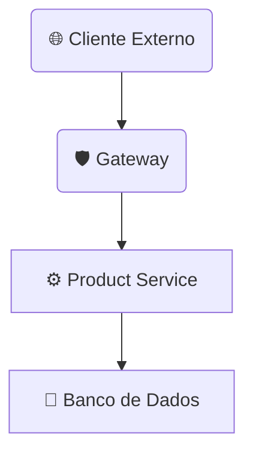

# Microserviço de Catálogo (Product API)

Este microsserviço é o núcleo do **Catálogo de Produtos** do domínio `store`, implementando todas as funcionalidades **CRUD (Create, Read, Update, Delete)**. Segue o padrão arquitetural de microsserviços do projeto, sendo dividido em **Contrato** (`product`) e **Implementação** (`product-service`), e operando sob a proteção do **Gateway** via **JWT**.

-----

## 🔒 Segurança e Acesso

Todas as interações externas com a API devem ser roteadas através da **camada de confiança (Gateway)**.

> ⚠️ **Acesso Restrito:** Para acessar as rotas em `/product/**`, é estritamente necessário fornecer um Token Web JSON (JWT) no cabeçalho.
>
> **Cabeçalho Requerido:** `Authorization: Bearer <jwt>`

-----

## 🧩 Módulos e Responsabilidades

A lógica do produto é estruturada em dois módulos de projeto distintos:

| Módulo | Tipo | Responsabilidade Principal |
| :--- | :--- | :--- |
| **`product`** | Interface/Contrato | Define os **DTOs** e a especificação **Feign** para consumo por clientes internos/externos. |
| **`product-service`** | Serviço/Implementação | Contém a camada **REST**, a **lógica de negócio**, a **persistência** (JPA) e as **migrações** do banco de dados (Flyway). |

```mermaid
graph TD
    A[Product-Service: Lógica de Negócio] --> B{ProductRepository: JPA};
    B --> C[Database: PostgreSQL];
    D[Product: Contrato (DTO/Feign)] --> A;
    E[Consumidores (Outros Módulos/Front)] --> D;
```

-----

## 🚦 Fluxo de Comunicação de Produtos

Este diagrama ilustra o caminho de uma requisição de produto, desde o cliente até a camada de persistência:



## 📦 Contrato da API (product)

Módulo que define a estrutura de dados e as operações disponíveis.

```tree
api/
    product/
        src/
            main/
                java/
                    store/
                        product/
                            ProductController.java
                            ProductIn.java
                            ProductOut.java
        pom.xml
        Jenkinsfile
```

| Arquivo (Título do Tab) | Linguagem | URL do Arquivo Remoto (`--8<--`) |
| :--- | :--- | :--- |
| **pom.xml** | `.xml` | `https://raw.githubusercontent.com/Lagoass/product/refs/heads/main/pom.xml` |
| **Jenkinsfile** | `.jenkinsfile` | `https://raw.githubusercontent.com/Lagoass/product/refs/heads/main/Jenkinsfile` |
| **ProductController** | `.java` | `https://raw.githubusercontent.com/Lagoass/product/refs/heads/main/src/main/java/store/product/ProductController.java` |
| **ProductIn** | `.java` | `https://raw.githubusercontent.com/Lagoass/product/refs/heads/main/src/main/java/store/product/ProductIn.java` |
| **ProductOut** | `.java` | `https://raw.githubusercontent.com/Lagoass/product/refs/heads/main/src/main/java/store/product/ProductOut.java` |

```{ bash }
> mvn clean install
```

## 🚀 Implementação do Serviço (product-service)

Onde reside a lógica de negócio, persistência (JPA) e configuração de *cache*.

```tree
api/
    product-service/
        k8s/
            k8s.yaml
        src/
            main/
                java/
                    store/
                        product/
                            Product.java
                            ProductApplication.java
                            ProductModel.java
                            ProductParser.java
                            ProductRepository.java
                            ProductResource.java
                            ProductService.java
                            RedisCacheConfig.java
                resources/
                    application.yaml
                    db/
                        migration/
                            V2025.08.29.001__create_schema.sql
                            V2025.08.29.002__create_table_product.sql
        pom.xml
        Dockerfile
        Jenkinsfile
```

| Arquivo (Título do Tab) | Linguagem | URL do Arquivo Remoto (`--8<--`) |
| :--- | :--- | :--- |
| **pom.xml** | `.xml` | `https://raw.githubusercontent.com/Lagoass/product-service/refs/heads/main/pom.xml` |
| **Dockerfile** | `.dockerfile` | `https://raw.githubusercontent.com/Lagoass/product-service/refs/heads/main/DockerFile` |
| **Jenkinsfile** | `.jenkinsfile` | `https://raw.githubusercontent.com/Lagoass/product-service/refs/heads/main/Jenkinsfile` |
| **k8s.yaml** | `.yaml` | `https://raw.githubusercontent.com/Lagoass/product-service/refs/heads/main/k8s/k8s.yaml` |
| **application.yaml** | `.yaml` | `https://raw.githubusercontent.com/Lagoass/product-service/refs/heads/main/src/main/resources/application.yaml` |
| **Product.java** | `.java` | `https://raw.githubusercontent.com/Lagoass/product-service/refs/heads/main/src/main/java/store/product/Product.java` |
| **ProductApplication.java** | `.java` | `https://raw.githubusercontent.com/Lagoass/product-service/refs/heads/main/src/main/java/store/product/ProductApplication.java` |
| **ProductModel.java** | `.java` | `https://raw.githubusercontent.com/Lagoass/product-service/refs/heads/main/src/main/java/store/product/ProductModel.java` |
| **ProductParser.java** | `.java` | `https://raw.githubusercontent.com/Lagoass/product-service/refs/heads/main/src/main/java/store/product/ProductParser.java` |
| **ProductRepository.java** | `.java` | `https://raw.githubusercontent.com/Lagoass/product-service/refs/heads/main/src/main/java/store/product/ProductRepository.java` |
| **ProductResource.java** | `.java` | `https://raw.githubusercontent.com/Lagoass/product-service/refs/heads/main/src/main/java/store/product/ProductResource.java` |
| **ProductService.java** | `.java` | `https://raw.githubusercontent.com/Lagoass/product-service/refs/heads/main/src/main/java/store/product/ProductService.java` |
| **RedisCacheConfig.java** | `.java` | `https://raw.githubusercontent.com/Lagoass/product-service/refs/heads/main/src/main/java/store/product/RedisCacheConfig.java` |
| **V2025.08.29.001__create_schema.sql** | `.sql` | `https://raw.githubusercontent.com/Lagoass/product-service/refs/heads/main/src/main/resources/db/migration/V2025.08.29.001__create_schema.sql` |
| **V2025.08.29.002__create_table_product.sql** | `.sql` | `https://raw.githubusercontent.com/Lagoass/product-service/refs/heads/main/src/main/resources/db/migration/V2025.08.29.002__create_table_product.sql` |

```{ bash }
> mvn clean package spring-boot:run
```